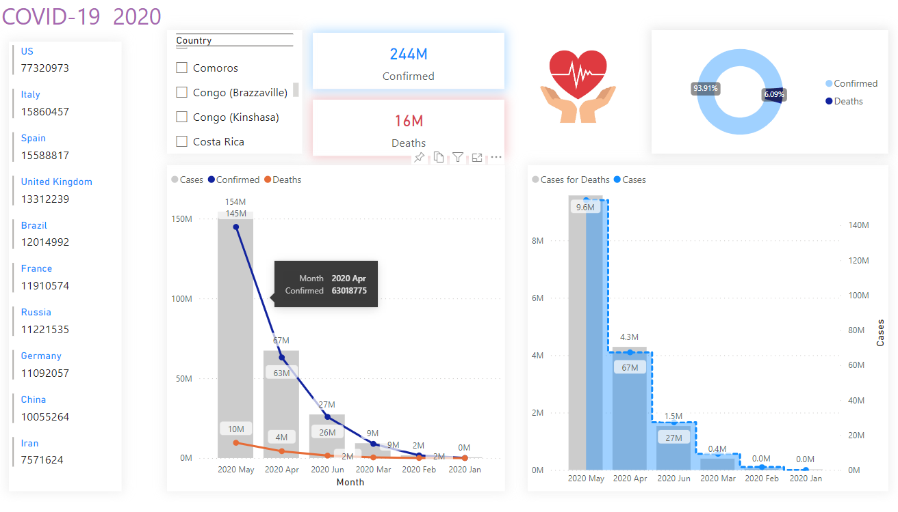
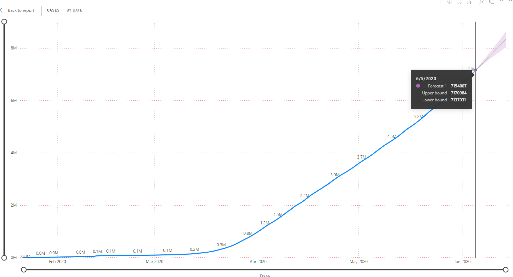

# COVID-19
La maladie à coronavirus 2019 (COVID-19) est une maladie infectieuse due au virus SARS-CoV-2.
La majorité des personnes atteintes de la COVID-19 ne ressentiront que des symptômes bénins ou modérés et guériront sans traitement particulier. Cependant, certaines tomberont gravement malades et auront besoin de soins médicaux.
##
 
##
 
 ##
 
 
